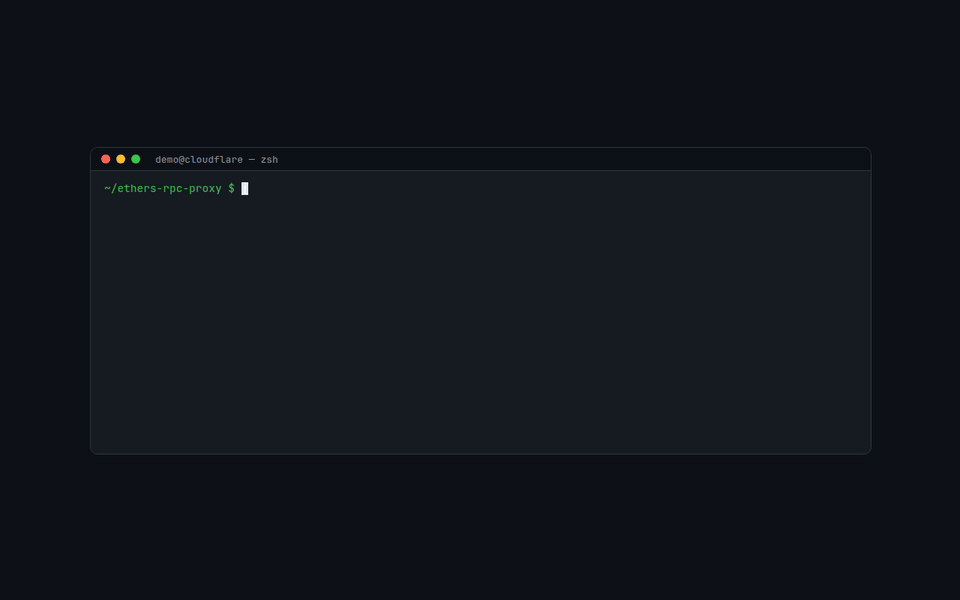

# Ethers RPC Proxy

[](https://deploy.workers.cloudflare.com/?url=https://github.com/Stapleport/ethers-rpc-proxy)

**[English](#english) | [中文](#中文)**

A read-only multi-chain EVM proxy running on Cloudflare Workers free tier: unified RPC access, ABI-decoded contract reads, and a built-in address book.

It never broadcasts transactions and never touches private keys — signing and broadcasting always happen in the client-side wallet. It is a specialized read gateway that makes "web2 frontend reads blockchain directly" fast, free, and safe.



*From `npm install` to a live deployment and an on-chain USDC balance query in ~20 seconds (sped up). Live demo: <https://ethers-rpc-proxy.kflc.workers.dev>*

[](https://deploy.workers.cloudflare.com/?url=https://github.com/Stapleport/ethers-rpc-proxy)

**One click, zero config.** The button connects this repo to your Cloudflare account, builds and deploys it as a Worker on the free tier, and gives you your own `*.workers.dev` URL. No environment variables or secrets needed — everything works out of the box.

---

<a id="english"></a>

## English

### Highlights

- **Read-only by design** — only view/pure calls and read RPC methods. `eth_sendRawTransaction`, `eth_sign*`, etc. are rejected with 403.
- **Multi-chain whitelist** — 15 mainnets + 6 testnets, ~5 public endpoints per chain with sequential failover.
- **ABI-decoded contract reads** — 10 built-in ABIs (ERC20/721/1155/4626, ownable, Multicall3, UniswapV2 trio, and the project's `Imputations`). Results are decoded; BigInts are serialized to strings.
- **Address book** — call well-known contracts by name (`usdc`, `weth`, `multicall3`); the per-chain address is resolved automatically.
- **CORS open** — browser frontends can call it directly.
- **Zero cost** — runs comfortably within the Cloudflare Workers free tier (100k req/day).

### Quick Start

```bash
npm install
npm run dev        # local dev at http://127.0.0.1:8787
```

Deploy to Cloudflare:

```bash
npx wrangler login   # first time only
npm run deploy
```

You get a URL like `https://ethers-rpc-proxy.<your-subdomain>.workers.dev`. The landing page at `/` is served by Workers Assets (`public/index.html`) with an interactive playground.

### API

All errors are `{ "success": false, "error": "..." }` with semantic status codes: 400 bad params, 403 write operation or non-whitelisted method, 404 unknown chain/contract/function, 502 all upstream nodes failed, 504 failover budget exhausted.

#### Contract read — GET (preferred)

`GET /api/call?chain=<id|name>&contract=<name>&fn=<function>&p=<param>&p=<param>...`

- `chain`: chainId, full name, shortName (`bnb`), or a common alias (`eth`, `bsc`, `polygon`, `arb`, `op`, `base`, `avax`...)
- `contract`: address-book name (raw 0x addresses are not supported on GET — the ABI cannot be reliably inferred from a URL)
- `p`: repeated query params, mapped to function inputs in order (numbers / `true` / `false` / JSON arrays are auto-coerced)

```bash
curl 'https://<your-worker>/api/call?chain=1&contract=usdc&fn=balanceOf&p=0xd8dA6BF26964aF9D7eEd9e03E53415D37aA96045'
# {"success":true,"result":"37192124",...}

curl 'https://<your-worker>/api/call?chain=bsc&contract=weth&fn=symbol'
# {"success":true,"result":"WBNB",...}
```

#### Contract read — POST

`POST /api/contract/call`

```json
{
  "chainId": 1,
  "contractAddress": "usdc",
  "functionName": "balanceOf",
  "params": ["0xd8dA6BF26964aF9D7eEd9e03E53415D37aA96045"]
}
```

`contractAddress` may be an address-book name (then `contractName` is inferred) or a raw 0x address (then `contractName` is required). Only view/pure functions are allowed.

#### Generic RPC

`POST /api/rpc`

```json
{ "chainId": 1, "request": { "method": "eth_blockNumber", "params": [] } }
```

Read methods are whitelisted (`eth_call`, `eth_getLogs`, `eth_getBalance`, `eth_feeHistory`, ...); broadcast/sign methods return 403. Batches (array bodies) are not supported — one method per request (400 otherwise). `eth_getLogs` with an explicit numeric block range wider than 10,000 blocks returns 400; narrow the range or use a named tag such as `latest`. Fee methods are fetched from the node directly; `eth_maxPriorityFeePerGas`/`eth_maxFeePerGas` return `null` on nodes that don't implement them.

#### Metadata (all GET)

| Endpoint | Description |
|---|---|
| `GET /api/chains` | Supported chains whitelist with endpoints |
| `GET /api/contracts` | Built-in ABI list |
| `GET /api/contracts/:name/functions` | Function list of an ABI (inputs/outputs/mutability) |
| `GET /api/addresses?chainId=1` | Address book; pass `chainId` (id, name, or alias) to resolve per-chain addresses |
| `GET /api/health` | Health check |

### Supported Chains

| Mainnet | | Testnet | |
|---|---|---|---|
| 1 | Ethereum | 97 | BSC Testnet |
| 10 | Optimism | 80002 | Polygon Amoy |
| 25 | Cronos | 84532 | Base Sepolia |
| 56 | BNB Smart Chain | 421614 | Arbitrum Sepolia |
| 100 | Gnosis | 11155111 | Ethereum Sepolia |
| 137 | Polygon | 11155420 | OP Sepolia |
| 204 | opBNB | | |
| 250 | Fantom | | |
| 324 | zkSync Era | | |
| 8453 | Base | | |
| 42161 | Arbitrum One | | |
| 43114 | Avalanche C-Chain | | |
| 5000 | Mantle | | |
| 59144 | Linea | | |
| 534352 | Scroll | | |

See `GET /api/chains` for the full list including endpoints. To add/remove chains, edit `MAINNETS`/`TESTNETS` in `scripts/trim-rpcs.mjs` and run `npm run trim-rpcs`.

### Custom Chains & Custom Upstream RPC

**Deployment-level: custom chain overlay.** Self-hosters can add their own chains (local dev chains, private/testnet chains) without touching the generated whitelist: edit `lib/chains.custom.json` and redeploy. The **only required field is `rpc`** — the `chainId` is read from the node via `eth_chainId` on first use (cached for the worker's lifetime). Give the entry a `name`/`shortName` so you can call it by name; entries that *do* carry a `chainId` are keyed by it directly (and override whitelist entries with the same id).

```json
[
  { "rpc": [{ "url": "http://127.0.0.1:8545" }] },
  {
    "name": "My Local Chain",
    "shortName": "local",
    "nativeCurrency": { "name": "Ether", "symbol": "ETH", "decimals": 18 },
    "rpc": [{ "url": "http://127.0.0.1:8545" }]
  }
]
```

The first (minimal) entry is usable via the `rpc` request parameter or by chain name; until its `chainId` has been resolved once, it cannot be looked up by numeric id. `name`/`shortName`/`nativeCurrency` are display-only metadata (there is no JSON-RPC method that exposes a chain's name or native-currency symbol — `eth_chainId` is the only on-chain identifier).

**Request-level: bring your own RPC.** Every call endpoint accepts an optional upstream `rpc` URL, so *any* EVM chain works without any config — `chainId` may be omitted and is read from the node via `eth_chainId`. Since an open public instance would be abusable as an open relay, this is gated by the `ALLOW_CUSTOM_RPC` var (`wrangler.jsonc`): `false` on public deployments (requests carrying `rpc` get `403`), set it to `"true"` on your own deployment to enable it.

```bash
# Generic RPC on any chain — no chainId needed
curl -X POST https://<your-worker>/api/rpc -H 'Content-Type: application/json' \
  -d '{"rpc":"http://127.0.0.1:8545","request":{"method":"eth_blockNumber","params":[]}}'

# Decoded contract read on any chain (raw address + ABI name)
curl -X POST https://<your-worker>/api/contract/call -H 'Content-Type: application/json' \
  -d '{"chainId":31337,"rpc":"http://127.0.0.1:8545","contractAddress":"0xYourContract","contractName":"token","functionName":"balanceOf","params":["0xYourAddress"]}'
```

The read-only guarantees are unchanged on custom upstreams: the method allowlist and the view/pure-only gate for contract calls still apply before any upstream request. When you pass `chainId` explicitly it is caller-asserted (the proxy answers `eth_chainId` locally from it); omit it and the proxy derives it from the node.

### Built-in Contracts

- **Imputations** — Stapleport collection contract (`getpath`/`getwalletadd`, balance queries, batch-collection params). Synced from hardhat artifacts.
- **token** — standard ERC20
- **erc721** — NFT standard incl. Enumerable reads
- **erc1155** — multi-token standard
- **erc4626** — vault standard (`convertToShares/Assets`, `preview*`, `max*`)
- **ownable** — `owner()`
- **multicall3** — batch reads in one request (`aggregate3`, `getEthBalance`); deployed at the same address `0xcA11bde05977b3631167028862bE2a173976CA11` on virtually every EVM chain
- **uniswapV2Router / Factory / Pair** — UniswapV2/PancakeSwap-compatible quotes and pool reads

### Browser Example

```javascript
// Latest block
const res = await fetch('https://<your-worker>/api/rpc', {
  method: 'POST',
  headers: { 'Content-Type': 'application/json' },
  body: JSON.stringify({ chainId: 56, request: { method: 'eth_blockNumber', params: [] } })
});
const { result } = await res.json();

// Token balance, ABI-decoded, via address book name
const res2 = await fetch('https://<your-worker>/api/call?chain=1&contract=usdc&fn=balanceOf&p=0x9876543210987654321098765432109876543210');
```

### Project Structure

```
├── src/worker.js          # Hono routes (CORS, status codes, validation)
├── lib/
│   ├── rpcHandler.js      # core: failover, method allowlist, contract reads, BigInt serialization
│   ├── rpcs.json          # chain whitelist (generated by scripts/trim-rpcs.mjs)
│   ├── abi.json           # contract ABIs (generated by scripts/sync-abi.mjs — do not edit)
│   └── addresses.json     # address book: name → per-chain address
├── scripts/
│   ├── sync-abi.mjs       # merge hardhat artifacts + standard-abis → lib/abi.json
│   ├── trim-rpcs.mjs      # trim full chainlist dump → chain whitelist
│   ├── dev-loop.sh        # dev watchdog: restarts wrangler on file change
│   └── standard-abis/     # hand-maintained standard contract ABIs
├── public/index.html      # landing page (Workers Assets)
└── wrangler.jsonc         # Cloudflare Workers config
```

### Maintenance

```bash
npm run trim-rpcs   # rebuild chain whitelist after editing MAINNETS/TESTNETS
npm run sync-abi    # rebuild lib/abi.json (after contract changes or adding standard ABIs)
npm run check-abi   # CI check: exits 1 if abi.json is stale
```

To add a standard contract (e.g. ERC721A), drop `erc721a.json` into `scripts/standard-abis/` and rerun `npm run sync-abi`. To add a hardhat contract, add a row to the `CONTRACTS` map in `scripts/sync-abi.mjs`.

**Failover strategy** — no pre-flight health checks (they waste subrequests and latency): nodes are tried in order; network errors / rate limits / 5xx / empty `eth_call` results switch to the next node, business errors (revert, invalid params) return immediately. A total failover budget of 15s caps the worst case (later nodes get shrinking timeouts); exhausting it yields 504. All nodes failing yields 502.

### Free-tier Notes

- Workers free tier: 100k req/day, 10ms CPU and 50 subrequests per request — plenty for read-heavy scenarios.
- The service is method-whitelisted (read-only); as a public endpoint it will attract scanners, so add a Cloudflare WAF rate-limit rule (e.g. 100 req/min per IP).
- Occasional rate limiting on upstream public nodes is normal; failover handles it.

---

<a id="中文"></a>

## 中文

部署在 Cloudflare Workers 免费版上的只读多链 EVM 中转服务：统一 RPC 接口 + 按 ABI 解码的合约读调用 + 常用合约地址簿。


*从 `npm install` 到部署上线、查到链上 USDC 余额，全程约 20 秒（已加速）。在线演示：<https://ethers-rpc-proxy.kflc.workers.dev>*

[](https://deploy.workers.cloudflare.com/?url=https://github.com/Stapleport/ethers-rpc-proxy)

**一键部署，零配置。** 点击按钮授权 Cloudflare 账号后，会自动关联本仓库、构建并部署为一个 Worker（免费版即可），直接得到你自己的 `*.workers.dev` 地址。不需要任何环境变量或密钥，开箱即用。

### 特性

- **只读定位**：只做读操作（view/pure 调用与读类 RPC 方法），从不广播交易、从不接触私钥——签名与广播一律由客户端钱包完成，`eth_sendRawTransaction` 等方法直接 403 拒绝。
- **多链白名单**：内置 15 条常用主网 + 6 条测试网，每链约 5 个公共节点做顺序 failover。
- **合约读调用**：内置 10 套 ABI（Imputations 归集合约、ERC20/721/1155/4626、ownable、multicall3、UniswapV2 三件套），结果自动解码、BigInt 自动转字符串。
- **地址簿**：常用合约直接用名称调用（`usdc`、`weth`、`multicall3`），各链地址自动解析。
- **CORS 开放**：浏览器前端可跨域直连。
- **零成本运行**：Cloudflare Workers 免费版即可承载（10 万请求/天）。

### 快速开始

```bash
npm install
npm run dev        # 本地跑在 http://127.0.0.1:8787
```

部署到 Cloudflare：

```bash
npx wrangler login   # 首次登录
npm run deploy
```

部署后形如 `https://ethers-rpc-proxy.<你的子域>.workers.dev`。落地页 `/` 由 Workers Assets 提供（`public/index.html`），带交互式调用演示。

### API

所有错误响应形如 `{ "success": false, "error": "..." }`，并带语义化状态码：400 参数缺失/不合法、403 写操作或方法不在白名单、404 链/合约/函数不存在、502 上游节点全部失败、504 failover 总预算耗尽。

#### 合约读调用 —— GET（优先）

`GET /api/call?chain=<id|名称>&contract=<名称>&fn=<函数>&p=<参数>&p=<参数>...`

- `chain`：chainId、链全名、shortName（`bnb`）或常见别名（`eth`、`bsc`、`polygon`、`arb`、`op`、`base`、`avax`…）
- `contract`：地址簿名称（GET 版不支持 0x 地址——URL 里无法可靠推断 ABI）
- `p`：重复的查询参数，按顺序对应函数入参（纯数字 / `true` / `false` / JSON 数组自动转换类型）

```bash
curl 'https://<your-worker>/api/call?chain=1&contract=usdc&fn=balanceOf&p=0xd8dA6BF26964aF9D7eEd9e03E53415D37aA96045'
# {"success":true,"result":"37192124",...}

curl 'https://<your-worker>/api/call?chain=bsc&contract=weth&fn=symbol'
# {"success":true,"result":"WBNB",...}
```

#### 合约读调用 —— POST

`POST /api/contract/call`

```json
{
  "chainId": 1,
  "contractAddress": "usdc",
  "functionName": "balanceOf",
  "params": ["0xd8dA6BF26964aF9D7eEd9e03E53415D37aA96045"]
}
```

`contractAddress` 可以是地址簿名称（此时 `contractName` 自动推断）或 0x 地址（此时必须显式给 `contractName`）。仅放行 view/pure 函数。

#### 通用 RPC

`POST /api/rpc`

```json
{ "chainId": 1, "request": { "method": "eth_blockNumber", "params": [] } }
```

只读方法白名单（`eth_call`、`eth_getLogs`、`eth_getBalance`、`eth_feeHistory` 等）；广播与签名类方法返回 403。不支持批量（数组）请求——一次一个方法，否则 400。`eth_getLogs` 显式数字 block range 超过 10000 块返回 400（缩小范围或改用 `latest` 等命名 tag）。fee 系列直接从节点单方法读取；节点不支持 `eth_maxPriorityFeePerGas`/`eth_maxFeePerGas` 时返回 `null`。

#### 元数据接口（均为 GET）

| 接口 | 说明 |
|---|---|
| `GET /api/chains` | 支持的链白名单与节点 |
| `GET /api/contracts` | 内置 ABI 列表 |
| `GET /api/contracts/:name/functions` | 某 ABI 的函数清单（入参/出参/可变性） |
| `GET /api/addresses?chainId=1` | 地址簿；传 chainId（数字/链名/别名）返回该链解析出的地址 |
| `GET /api/health` | 健康检查 |

### 支持的链

| 主网 | | 测试网 | |
|---|---|---|---|
| 1 | Ethereum | 97 | BSC Testnet |
| 10 | Optimism | 80002 | Polygon Amoy |
| 25 | Cronos | 84532 | Base Sepolia |
| 56 | BNB Smart Chain | 421614 | Arbitrum Sepolia |
| 100 | Gnosis | 11155111 | Ethereum Sepolia |
| 137 | Polygon | 11155420 | OP Sepolia |
| 204 | opBNB | | |
| 250 | Fantom | | |
| 324 | zkSync Era | | |
| 8453 | Base | | |
| 42161 | Arbitrum One | | |
| 43114 | Avalanche C-Chain | | |
| 5000 | Mantle | | |
| 59144 | Linea | | |
| 534352 | Scroll | | |

完整清单（含每链 RPC 节点）见 `GET /api/chains`。要增删链：改 `scripts/trim-rpcs.mjs` 里的 `MAINNETS`/`TESTNETS` 白名单后重跑 `npm run trim-rpcs`。

### 自定义链与自定义上游 RPC

**部署级：自定义链 overlay。** 自部署者要加自己的链（本地开发链、私有链/测试链），不必碰生成的白名单文件：编辑 `lib/chains.custom.json` 后重新部署即可。**唯一必填的字段是 `rpc`**——`chainId` 会在该链第一次被用到时向上游读 `eth_chainId` 自动补全（实例生命周期内缓存）。建议给条目配 `name`/`shortName` 以便按名称调用；带 `chainId` 的条目直接按 id 入表（同 id 覆盖白名单条目）。

```json
[
  { "rpc": [{ "url": "http://127.0.0.1:8545" }] },
  {
    "name": "My Local Chain",
    "shortName": "local",
    "nativeCurrency": { "name": "Ether", "symbol": "ETH", "decimals": 18 },
    "rpc": [{ "url": "http://127.0.0.1:8545" }]
  }
]
```

第一个（最小）条目经 `rpc` 请求参数或按链名即可使用；它的 `chainId` 补全过一次之前无法按数字 id 命中。`name`/`shortName`/`nativeCurrency` 纯属展示元数据——JSON-RPC 没有任何方法能读到链名或原生币符号（链上唯一的标识就是 `eth_chainId`）。

**请求级：自带上游 RPC。** 所有调用端点都接受可选的上游 `rpc` 参数，因此*任何* EVM 链无需任何配置即可对接——`chainId` 可省略，代理自己向节点读 `eth_chainId`。公开实例放开会被人当开放中继滥用，所以由 `ALLOW_CUSTOM_RPC` 变量（`wrangler.jsonc`）门控：公共部署保持 `false`（带 `rpc` 的请求返回 `403`），自建部署改成 `"true"` 即可启用。

```bash
# 任意链的通用 RPC——chainId 都不用传
curl -X POST https://<your-worker>/api/rpc -H 'Content-Type: application/json' \
  -d '{"rpc":"http://127.0.0.1:8545","request":{"method":"eth_blockNumber","params":[]}}'

# 任意链的 ABI 解码读（裸地址 + ABI 名）
curl -X POST https://<your-worker>/api/contract/call -H 'Content-Type: application/json' \
  -d '{"chainId":31337,"rpc":"http://127.0.0.1:8545","contractAddress":"0xYourContract","contractName":"token","functionName":"balanceOf","params":["0xYourAddress"]}'
```

自定义上游不改变只读承诺：方法白名单与合约 view/pure-only 门禁在任何上游请求之前照常生效。显式传了 `chainId` 就按调用方的来（代理据此本地应答 `eth_chainId`）；省略则由代理从节点读取。

### 内置合约

- **Imputations** —— Stapleport 归集合约：收款地址派生（`getpath`/`getwalletadd`）、到账查询（`gettokensreceiveds`）、批量归集参数读取（`imputationall` 等）。从 hardhat 编译产物同步。
- **token** —— 标准 ERC20
- **erc721** —— NFT 标准（含 Enumerable 读扩展）
- **erc1155** —— 多代币标准
- **erc4626** —— 金库标准（`convertToShares/Assets`、`preview*`、`max*`）
- **ownable** —— 归属查询 `owner()`
- **multicall3** —— 单请求批量读（`aggregate3`）+ `getEthBalance`；几乎所有 EVM 链同地址部署（`0xcA11bde05977b3631167028862bE2a173976CA11`），对只读代理最实用
- **uniswapV2Router / Factory / Pair** —— UniswapV2/PancakeSwap 同构接口：报价与池子读取

### 浏览器调用示例

```javascript
// 查最新区块
const res = await fetch('https://<your-worker>/api/rpc', {
  method: 'POST',
  headers: { 'Content-Type': 'application/json' },
  body: JSON.stringify({ chainId: 56, request: { method: 'eth_blockNumber', params: [] } })
});
const { result } = await res.json();

// 查代币余额：ABI 自动解码，走地址簿名称
const res2 = await fetch('https://<your-worker>/api/call?chain=1&contract=usdc&fn=balanceOf&p=0x9876543210987654321098765432109876543210');
```

### 项目结构

```
├── src/worker.js          # Hono 路由入口（CORS、状态码、参数校验）
├── lib/
│   ├── rpcHandler.js      # 核心逻辑：failover、方法白名单、合约读调用、BigInt 序列化
│   ├── rpcs.json          # 链白名单（scripts/trim-rpcs.mjs 生成）
│   ├── abi.json           # 合约 ABI（scripts/sync-abi.mjs 生成，勿手改）
│   └── addresses.json     # 地址簿：常用合约名称 → 各链地址
├── scripts/
│   ├── sync-abi.mjs       # ABI 同步：hardhat artifacts + standard-abis → lib/abi.json
│   ├── trim-rpcs.mjs      # chainlist 全量 → 链白名单裁剪
│   ├── dev-loop.sh        # 开发守护：文件变化自动重启 wrangler
│   └── standard-abis/     # 人工维护的标准合约 ABI
├── public/index.html      # 落地页（Workers Assets）
└── wrangler.jsonc         # Cloudflare Workers 配置
```

### 维护

```bash
npm run trim-rpcs   # 改 MAINNETS/TESTNETS 后重建链白名单
npm run sync-abi    # 重建 lib/abi.json（合约改动或增删标准 ABI 后）
npm run check-abi   # CI 检查：abi.json 过期则退出码 1
```

要加标准合约（如 ERC721A）：在 `scripts/standard-abis/` 放一个 `erc721a.json`，重跑 `npm run sync-abi`。要同步其他 hardhat 合约：在 `scripts/sync-abi.mjs` 的 `CONTRACTS` 表里加一行。

**Failover 策略** —— 不做前置健康检查（省子请求与延迟）：按 `rpcs.json` 顺序逐个节点请求，网络错误/限流/5xx/空 `eth_call` 结果自动切下一个；业务错误（revert、参数不合法）直接返回不换节点。failover 总预算 15s（后备节点超时随剩余预算递减），耗尽返回 504；所有节点失败返回 502。

### 免费额度与限制

- Workers 免费版：10 万请求/天、每请求 10ms CPU / 50 个子请求——对收款查询/对账场景绰绰有余。
- 公网服务会被扫描器盯上：已做方法白名单（只读），建议再在 Cloudflare 后台加 WAF 速率限制规则（如每 IP 100 req/min）。
- 上游公共节点偶发限流属正常现象，failover 会自动切换。

### 监控

- `GET /api/health` 健康检查
- Cloudflare 后台 Workers Logs（wrangler.jsonc 已开启 observability）

## License

MIT
